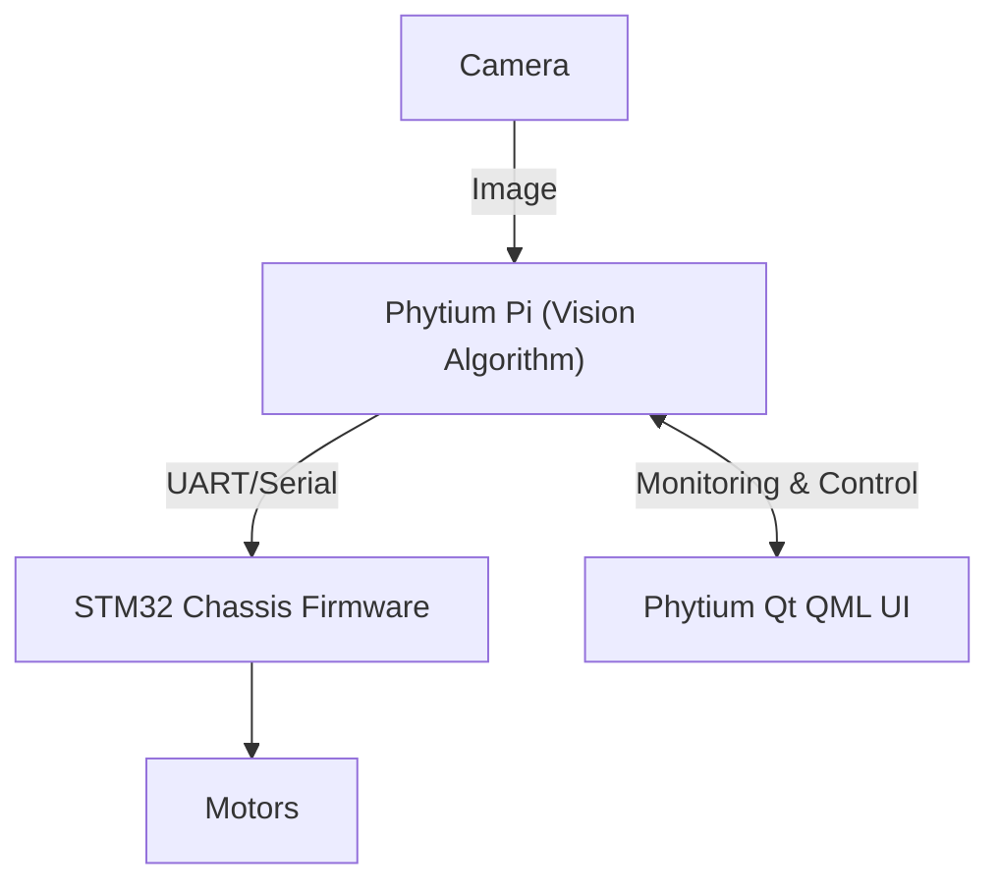

[中文说明](README_CN.md)

# Desert Photovoltaic Inspection Robot System

[](#) [](LICENSE) [](#)

The **Desert Photovoltaic Inspection Robot System** is an intelligent robotic platform designed specifically for desert and harsh environment solar power plants. Powered by the high-performance Phytium Pi and STM32 microcontroller, the system automatically detects defects in solar panels using target detection models and performs path tracking, control, and real-time monitoring through a Qt QML dashboard.

---

## 1. System Architecture

The robot consists of a visual sensor, an onboard Phytium Pi computer running inference, a Qt QML frontend for visualization, and an STM32-driven chassis for locomotion.



---

## 2. Directory Structure

```text
photovoltaic-inspection-system/
├── .gitignore              # Git ignore rules
├── LICENSE                 # Project license (MIT)
├── CONTRIBUTING.md         # Contribution guidelines
├── README.md               # Main bilingual README
├── README_EN.md            # English README
├── README_CN.md            # Chinese README
├── docs/                   # Documentation and tutorials
│   └── GIT_TUTORIAL.md     # Git and LFS tutorial
├── qt-ui/                  # Phytium Qt QML Dashboard
│   ├── PhytiumCarUI/       # QML Application source
│   └── run_system.sh       # Startup script
├── stm32-chassis/          # STM32 low-level motor chassis control firmware
│   ├── BSP/                # Board Support Package
│   └── CHASSIS/            # Chassis control and PID tuning logic
└── vision-algorithm/       # Phytium Pi camera vision algorithm
    ├── solar_panel_int8.onnx # Quantized target detection model
    └── phytium_accelerator.py # Hardware-accelerated inference script
```

---

## 3. Hardware Requirements

- **STM32 Chassis Controller**: STM32F103ZET6 development board for chassis motor PID control, battery voltage monitoring, and sensor processing.
- **Onboard Computer**: Phytium Pi (飞腾派) single board computer for real-time target detection and hosting the Qt QML GUI.
- **Sensors & Actuators**: High-resolution USB or MIPI camera, 4WD chassis with encoder motors, steering servos.

---

## 4. Quick Start

### 4.1 stm32-chassis (Keil Compilation)
1. Open the project inside `stm32-chassis/` using Keil MDK (uVision5).
2. Click **Build** to compile the project (ensure zero compile errors).
3. Connect your ST-Link or J-Link to flash the generated hex/axf firmware to the STM32F103ZET6 board.

### 4.2 vision-algorithm (Python Setup & Inference)
1. Navigate to the `vision-algorithm` directory.
2. Install the necessary dependencies (such as OpenCV, ONNX Runtime):
   ```bash
   pip install opencv-python onnxruntime
   ```
3. Run the target detection algorithm script:
   ```bash
   python realtime_detector_accel.py
   ```

### 4.3 qt-ui (Qt QML Compilation & Run)
1. Ensure Qt 5.15+ (with QML support) is installed on the Phytium Pi.
2. Navigate to `qt-ui/PhytiumCarUI`.
3. Run the following commands to compile and start the GUI:
   ```bash
   qmake PhytiumCarUI.pro
   make
   ./PhytiumCarUI
   ```
4. Alternatively, use the `run_system.sh` script to launch the visual detector and UI simultaneously.

---

## 5. Authors & Contributors

- 李帅 (Shuai Li)
- 赵禹博 (Yubo Zhao)
- 吴坨鑫 (Tuoxin Wu)

---

## 6. License

This project is licensed under the [MIT License](LICENSE).

