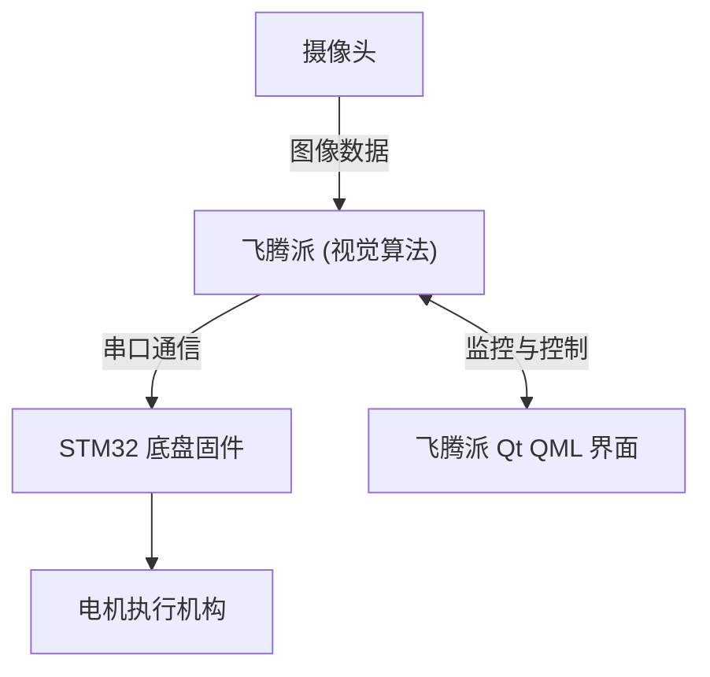

# 沙戈荒光伏巡检系统部署与调试教程

本教程详细介绍沙戈荒光伏巡检机器人系统的硬件连接、软件环境搭建、各个子系统的编译部署以及双端联调步骤。

---

## 1. 系统总体架构与数据流

本系统由三个核心部分组成：
1. **STM32 下位机底盘控制器**：负责四驱电机的 PID 调速、航向角偏差修正以及传感器数据采集。
2. **飞腾派上位机视觉检测端**：基于量化后的目标检测模型（`solar_panel_int8.onnx`）进行实时光伏板缺陷识别。
3. **飞腾派 Qt QML 监控大屏**：作为人机交互界面，展示车辆运行状态、传感器回传数据与 AI 识别结果，并提供下行控制。



### 1.1 双端串口通信协议
飞腾派与 STM32 之间通过物理串口（波特率 `115200`，`8N1`）进行双向二进制数据传输。

**数据上报格式（STM32 -> 飞腾派）**：
* 帧头：`0xAA 0x55` (2 字节)
* 长度：`0x08` (1 字节)
* 实时速度：(2 字节，单位 `mm/s`)
* 动力电压：(2 字节，单位 `mV`)
* 温度：(1 字节，单位 `℃`)
* 故障码：(1 字节)
* 校验和：前述所有字节异或校验 (1 字节)

**控制指令格式（飞腾派 -> STM32）**：
* 格式为 ASCII 字符指令，以回车换行 `\r\n` 结尾。
* 例如：设置速度为线速度 v=0.5m/s，角速度 w=0.1rad/s：`vel 500 100\r\n`
* 紧急停止：`stop\r\n`
* 舵机归中：`scenter\r\n`

---

## 2. 下位机部署说明 (stm32-chassis)

### 2.1 硬件连接
1. 将 STM32F103ZET6 开发板固定在小车底盘上。
2. 将四路电机驱动模块（如 TB6612）的 PWM 输入脚与 STM32 的定时器（如 TIM1/TIM8）对应引脚连接。
3. 将编码器 A/B 相输出连接至定时器编码器模式输入引脚（如 TIM2/TIM3/TIM4/TIM5）。
4. 将串口 1（PA9/PA10）或串口 3（PB10/PB11）连接到板载串口转 USB 模块，或直接引出 TX/RX 连接至飞腾派的对应串口。

### 2.2 软件编译与烧录
1. 安装 **Keil MDK (uVision5)** 及 STM32F1xx 芯片支持包。
2. 打开 `stm32-chassis/USER/` 目录下的 Keil 工程文件。
3. 点击 **Rebuild** 编译按钮，确保编译输出 `0 Error(s), 0 Warning(s)`。
4. 使用 ST-Link、J-Link 或 DAP 仿真器连接 STM32 开发板。
5. 点击 **Download** (F8) 将编译生成的固件烧录至芯片中。
6. 重启开发板，底盘显示屏应正常亮起，等待串口指令。

---

## 3. 视觉算法部署说明 (vision-algorithm)

飞腾派（上位机）运行目标检测算法，实时分析摄像头捕获的光伏面板视频流。

### 3.1 环境搭建
在飞腾派 Linux 系统终端中，配置 Python 3.9 环境：

```bash
# 更新系统包管理器
sudo apt-get update

# 安装 OpenCV 与 ONNX Runtime 运行依赖项
pip3 install opencv-python onnxruntime numpy
```

### 3.2 运行目标检测
1. 将摄像头接入飞腾派的 USB 接口或 CSI 接口。
2. 进入 `vision-algorithm/` 目录。
3. 启动实时目标检测主程序：
   ```bash
   python3 realtime_detector_accel.py
   ```
4. 程序会调用 `solar_panel_int8.onnx` 量化模型，并在屏幕上框选出故障光伏板，同时通过 `/tmp/ipc_vision.json` 文件及串口与下位机进行通信。

---

## 4. UI 客户端部署说明 (qt-ui)

Qt QML 监控界面提供仪表盘展示、手动控制以及 AI 检测状态同步。

### 4.1 环境搭建
确保飞腾派系统已安装 Qt5 环境：

```bash
sudo apt-get install qt5-default qtcreator qtdeclarative5-dev libqt5serialport5-dev
```

### 4.2 编译与运行
1. 进入 `qt-ui/PhytiumCarUI/` 目录。
2. 使用 `qmake` 生成 Makefile 并编译：
   ```bash
   qmake PhytiumCarUI.pro
   make -j4
   ```
3. 编译完成后，执行以下命令运行监控程序：
   ```bash
   ./PhytiumCarUI
   ```

---

## 5. 双端联合一键启动与调试

为了方便比赛中脱机运行，可以使用 `qt-ui/` 目录下的一键启动脚本 `run_system.sh`。

### 5.1 启动脚本机制
该脚本会自动完成以下动作：
1. 启动 `serial_bridge.py` 脚本，开启上位机飞腾派与下位机 STM32 的物理串口双向同步。
2. 在后台静默运行视觉检测算法。
3. 启动 Qt QML 监控大屏。

### 5.2 使用方法
```bash
cd qt-ui/
chmod +x run_system.sh
./run_system.sh
```

---
📅 **修订日期**：2026年6月12号  
✍️ **作者**：李帅、赵禹博、吴坨鑫  
🏆 **项目所有权**：沙戈荒光伏巡检系统研发团队  
